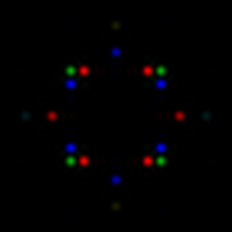
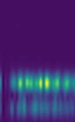

============================================
Representing crystal structures: descriptors
============================================
.. module:: ai4materials.wrappers.calc_descriptor-example
   :synopsis: Function to calculate a descriptor given a crystal structure.

The first necessary step to perform any machine learning and/or automatized analysis on materials science data 
is to represent the material under consideration in a way that is understandable for a computer. This representation - termed
descriptor - should contain all the relevant information on the system needed for the desired learning task.

Starting from crystal structure, provided as ASE (Atomistic Simulation Environment) Atoms object
`[link] <https://wiki.fysik.dtu.dk/ase/ase/atoms.html?highlight=atoms%20object>`_, the code allows to calculate different representations.
Currently, the following descriptors (i.e. function to represent crystal structures) are implemented:

* :py:mod:`ai4materials.descriptors.atomic_features` returns the atomic features corresponding to the chemical species of the system [1]_
* :py:mod:`ai4materials.descriptors.diffraction2d` calculates the two-dimensional diffraction fingerprint [2]_
* :py:mod:`ai4materials.descriptors.diffraction3d` calculates the three-dimensional diffraction fingerprint [3]_
* :py:mod:`ai4materials.descriptors.prdf` calculates the partial radial distribution function [4]_
* :py:mod:`ai4materials.descriptors.SOAP` calculates the SOAP descriptor [5]_

For example of descriptors' usage and their references, see below.

Example: atomic features
------------------------------------------------
.. module:: ai4materials.descriptors.atomic_features-example
   :synopsis: Retrieve atomic features from a crystal structure

It was recently shown in Ref. [1]_ that the crystal structure of binary compounds can be predicted using compressed-sensing
technique using atomic features only.

The code below illustrates how to retrieve atomic features for one crystal structure. It performs the following steps:

* build a NaCl crystal structure using the ASE package
* calculate atomic features using the descriptor :py:mod:`ai4materials.descriptors.atomic_features.AtomicFeatures`
* retrieve the atomic features of this crystal structure as the panda dataframe ``nacl_atomic_features``
* save this table to file.

.. testcode::

    import sys
    import os.path

    atomic_data_dir = os.path.abspath(os.path.normpath("/home/ziletti/nomad/nomad-lab-base/analysis-tools/atomic-data"))
    sys.path.insert(0, atomic_data_dir)

    from ase.spacegroup import crystal
    from ai4materials.utils.utils_config import set_configs
    from ai4materials.utils.utils_config import setup_logger
    from ai4materials.descriptors.atomic_features import AtomicFeatures
    from nomadcore.local_meta_info import loadJsonFile, InfoKindEl

    # setup configs
    configs = set_configs(main_folder='./desc_atom_features_ai4materials')
    logger = setup_logger(configs, level='INFO', display_configs=False)

    desc_file_name = 'atomic_features_try1'

    # build atomic structure
    structure = crystal(['Na', 'Cl'], [(0, 0, 0), (0.5, 0.5, 0.5)], spacegroup=225, cellpar=[5.64, 5.64, 5.64, 90, 90, 90])

    selected_feature_list = ['atomic_ionization_potential', 'atomic_electron_affinity',
                             'atomic_rs_max', 'atomic_rp_max', 'atomic_rd_max']

    # define and calculate descriptor
    kwargs = {'feature_order_by': 'atomic_mulliken_electronegativity', 'energy_unit': 'eV', 'length_unit': 'angstrom'}

    descriptor = AtomicFeatures(configs=configs, **kwargs)

    structure_result = descriptor.calculate(structure, selected_feature_list=selected_feature_list)
    nacl_atomic_features = structure_result.info['descriptor']['atomic_features_table']

    # write table to file
    nacl_atomic_features.to_csv('nacl_atomic_features_table.csv', float_format='%.4f')

This is the table (saved in the file `nacl_atomic_features_table.csv`) containing the atomic features obtained using the code above:

.. csv-table::
   :file: nacl_atomic_features_table.csv
   :header-rows: 1

Example: two-dimensional diffraction fingerprint
------------------------------------------------
.. module:: ai4materials.descriptors.diffraction2d-example
   :synopsis: Two-dimensional diffraction fingerprint calculation example

The two-dimensional diffraction fingerprint was introduced in Ref. [2]_.

The code below illustrates how to calculate the two-dimensional diffraction fingerprint for a supercell of
face-center-cubic aluminium containing approximately 256 atoms, performing following steps:

* build a face-centered-cubic aluminium crystal structure using the ASE package
* create a supercell using the function :py:mod:`ai4materials.utils.utils_crystals.create_supercell`
* calculate the two-dimensional diffraction fingerprint of this crystal structure as the numpy.array ``intensity_rgb``
* convert the two-dimensional diffraction fingerprint as RGB image and write it to file.

.. testcode::

    from ase.spacegroup import crystal
    from ase.io import write
    from ai4materials.descriptors.diffraction2d import Diffraction2D
    from ai4materials.utils.utils_config import set_configs
    from ai4materials.utils.utils_crystals import create_supercell
    import numpy as np
    from PIL import Image

    # setup configs
    configs = set_configs(main_folder='./desc_2d_diff_ai4materials')

    # create the fcc aluminium structure
    fcc_al = crystal('Al', [(0, 0, 0)], spacegroup=225, cellpar=[4.05, 4.05, 4.05, 90, 90, 90])
    structure = create_supercell(fcc_al, target_nb_atoms=256)

    # calculate the two-dimensional diffraction fingerprint
    descriptor = Diffraction2D(configs=configs)
    structure_result = descriptor.calculate(structure)
    intensity_rgb = structure_result.info['descriptor']['diffraction_2d_intensity']

    # write the diffraction fingerprint as png image
    rgb_array = np.zeros((intensity_rgb.shape[0], intensity_rgb.shape[1], intensity_rgb.shape[2]), 'uint8')
    current_img = list(intensity_rgb.reshape(-1, intensity_rgb.shape[0], intensity_rgb.shape[1]))
    for ix_ch in range(len(current_img)):
        rgb_array[..., ix_ch] = current_img[ix_ch] * 255
    img = Image.fromarray(rgb_array)
    img = img.resize([256, 256], Image.ANTIALIAS)
    img.save('fcc_al_diffraction2d_fingerprint.png')

This is the calculated two-dimensional diffraction fingerprint for face-centered-cubic aluminium:

Implementation details of the two-dimensional diffraction fingerprint can be found at
:py:mod:`ai4materials.descriptors.diffraction2d`.

Example: three-dimensional diffraction fingerprint
--------------------------------------------------
.. module:: ai4materials.descriptors.diffraction3d-example
   :synopsis: Three-dimensional diffraction fingerprint calculation example

The three-dimensional diffraction fingerprint was introduced in Ref. [3]_.

The code below illustrates how to calculate the three-dimensional diffraction fingerprint for a supercell of
face-center-cubic aluminium containing approximately 256 atoms, performing following steps:

* build a face-centered-cubic aluminium crystal structure using the ASE package
* create a supercell using the function :py:mod:`ai4materials.utils.utils_crystals.create_supercell`
* calculate the three-dimensional diffraction fingerprint of this crystal structure as the numpy.array ``diff3d_spectrum``
* convert the two-dimensional diffraction fingerprint as a heatmap image and write it to file.

.. testcode::

    from ase.spacegroup import crystal
    import matplotlib.pyplot as plt
    from ai4materials.descriptors.diffraction3d import DISH
    from ai4materials.utils.utils_config import set_configs
    from ai4materials.utils.utils_crystals import create_supercell
    from scipy import ndimage

    # setup configs
    configs = set_configs(main_folder='./dish_ai4materials')

    # create the fcc aluminium structure
    fcc_al = crystal('Al', [(0, 0, 0)], spacegroup=225, cellpar=[4.05, 4.05, 4.05, 90, 90, 90])
    structure = create_supercell(fcc_al, target_nb_atoms=256, random_rotation=True, cell_type='standard', optimal_supercell=False)

    # calculate the two-dimensional diffraction fingerprint
    descriptor = DISH(configs=configs)
    structure_result = descriptor.calculate(structure)
    diff3d_spectrum = descriptor.calculate(structure).info['descriptor']['diffraction_3d_sh_spectrum']

    # plot the (enlarged) array as image (enlarging is unphysical, only for visualization purposes)
    plt.imsave('fcc_al_diffraction3d_fingerprint.png', ndimage.zoom(diff3d_spectrum, (4, 4)))

This is the calculated three-dimensional diffraction fingerprint for face-centered-cubic aluminium (zoomed for visualization purposes):

Implementation details of the three-dimensional diffraction fingerprint can be found at
:py:mod:`ai4materials.descriptors.diffraction3d`.

.. [1] L. M. Ghiringhelli, J. Vybiral, S. V. Levchenko, C. Draxl, and M. Scheffler, “Big Data of Materials
   Science: Critical Role of the Descriptor,” Physical Review Letters, vol. 114, no. 10, p. 105503 .
   [`Link to article <https://link.aps.org/doi/10.1103/PhysRevLett.114.105503>`_]
.. [2] A. Ziletti, D. Kumar, M. Scheffler, and L. M. Ghiringhelli, "Insightful classification of crystal structures
   using deep learning," Nature Communications, vol. 9, pp. 2775, 2018.
   [`Link to article <https://arxiv.org/abs/1709.02298>`_]
.. [3] A. Ziletti, A. Leitherer, M. Scheffler, and L. M. Ghiringhelli, in preparation (2018)
.. [4] K. T. Schuett, H. Glawe, F. Brockherde, A. Sanna, K. R. M\"uller, and E. K. U.Gross,
   "How to represent crystal structures for machine learning: Towards fast prediction of electronic properties,"
   Physical Review B, vol. 89, pp. 205118 (2014).
   [`Link to article <https://link.aps.org/doi/10.1103/PhysRevB.89.205118>`_]
.. [5] A. P. Bartók, R. Kondor, and G. Csányi, “On representing chemical environments,”
   Physical Review B, vol. 87, no. 18, p.184115 (2013)
   [`Link to article <http://link.aps.org/doi/10.1103/PhysRevB.87.184115>`_]

.. sectionauthor:: Angelo Ziletti <angelo.ziletti@gmail.com>

Submodules
----------

.. toctree::

   ai4materials.descriptors.atomic_features
   ai4materials.descriptors.base_descriptor
   ai4materials.descriptors.diffraction1d
   ai4materials.descriptors.diffraction2d
   ai4materials.descriptors.diffraction3d
   ai4materials.descriptors.ft_soap_descriptor   
   ai4materials.descriptors.prdf
   ai4materials.descriptors.quippy_soap_descriptor   
   ai4materials.descriptors.soap_model

Module contents
---------------

.. automodule:: ai4materials.descriptors
    :members:
    :undoc-members:
    :show-inheritance:
