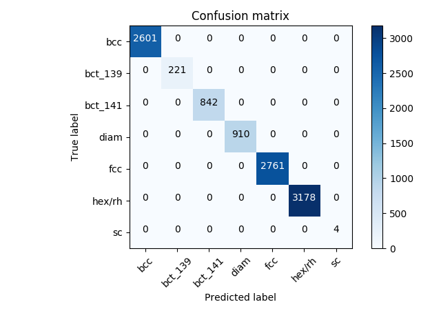

Regression and classification models
====================================
*ai4materials* allows to apply state-of-the-art data-analytics models to relevant materials science. Below, we present an
example based on compressed sensing.

Example regression: LASSO+l0 method
------------------------------------------------
.. module:: ai4materials.models.l1_l0-example
   :synopsis: LASSO + L0 example

This example shows how to find descriptive parameters (short formulas) that predict crystal structure,
using the example of octet binary compounds that have either rocksalt (RS) or zincblende (ZB) structure.
It is based on Ref. [1]_, and it allows to reproduce the results presented in Fig. 2  of this reference.

Starting from simple physical quantities ("building blocks", here properties of the constituent
free atoms such as orbital radii), thousands of candidate formulas are generated by applying arithmetic
operations combining building blocks, for example forming sums and products of them.
These candidate formulas constitute the so-called "feature space".
Then, a sparse regression method is used to select only a few of these formulas that explain the data.

The code below performs following steps:

* read the dataset containing binary materials from file
* calculate the atomic features using the descriptor :py:mod:`ai4materials.descriptors.atomic_features.AtomicFeatures`
* calculate the descriptive parameters using the LASSO+l0 method with :py:mod:`ai4materials.wrappers.calc_model`
* plot the results.

.. testcode::

    import sys
    import os.path

    atomic_data_dir = os.path.normpath('/home/ziletti/nomad/nomad-lab-base/analysis-tools/atomic-data')
    sys.path.insert(0, atomic_data_dir)

    import matplotlib.pyplot as plt
    from ai4materials.utils.utils_config import set_configs
    from ai4materials.utils.utils_config import setup_logger
    from ai4materials.utils.utils_data_retrieval import read_ase_db
    from ai4materials.wrappers import load_descriptor
    from ai4materials.wrappers import calc_model
    from ai4materials.wrappers import calc_descriptor
    from ai4materials.descriptors.atomic_features import AtomicFeatures
    from ai4materials.descriptors.atomic_features import get_table_atomic_features
    from ai4materials.utils.utils_config import get_data_filename
    from ai4materials.visualization.viewer import read_control_file
    import numpy as np
    import pandas as pd

    # modify this path if you want to save the calculation results in another location
    configs = set_configs(main_folder='./l1_l0_example')
    logger = setup_logger(configs, level='INFO')

    # setup folder and files
    lookup_file = os.path.join(configs['io']['main_folder'], 'lookup.dat')
    materials_map_plot_file = os.path.join(configs['io']['main_folder'], 'binaries_l1_l0_map_prl2015.png')

    # define descriptor - atomic features in this case
    kwargs = {'energy_unit': 'eV', 'length_unit': 'angstrom'}
    descriptor = AtomicFeatures(configs=configs, **kwargs)

    # =============================================================================
    # Descriptor calculation
    # =============================================================================

    desc_file_name = 'atomic_features_binaries'
    ase_db_file = get_data_filename('data/db_ase/binaries_lowest_energy_ghiringhelli2015.json')
    ase_atoms_list = read_ase_db(db_path=ase_db_file)

    selected_feature_list = ['atomic_ionization_potential', 'atomic_electron_affinity', 'atomic_rs_max',
                             'atomic_rp_max', 'atomic_rd_max']
    allowed_operations = ['+', '-', '/', '|-|', 'exp', '^2']

    desc_file_path = calc_descriptor(descriptor=descriptor, configs=configs, ase_atoms_list=ase_atoms_list,
                                     desc_file='lasso_l0_binaries_example.tar.gz',
                                     format_geometry='aims',
                                     selected_feature_list=selected_feature_list,
                                     nb_jobs=-1)

    # load descriptor
    target_list, structure_list = load_descriptor(desc_files=desc_file_path, configs=configs)
    df_atomic_features = get_table_atomic_features(structure_list)

    # =============================================================================
    # Model calculation
    # =============================================================================

    chemical_formulas = [structure.get_chemical_formula(mode='hill') for structure in structure_list]
    df_atomic_features['chemical_formula'] = chemical_formulas
    df_atomic_features = df_atomic_features.sort_values(by='chemical_formula').reset_index(drop=True)

    # target values to predict
    dict_delta_e = dict(SeZn=0.2631369195046646, BaTe=-0.37538683850924387, BN=1.7120803923951688,
                        CGe=0.8114429425515818, GaP=0.3487518245522925, MgS=-0.08669951164989079,
                        GaN=0.4334452723999156, AlAs=0.21326186549251072, BP=1.019225239514441, FK=-0.14640610974868423,
                        BrLi=-0.03274621540254649, BSb=0.5808491589999847, CaTe=-0.3504563060008138,
                        ClK=-0.16446069285018655, BrCs=-0.1558673149861294, BrCu=0.15244265149855352,
                        ILi=-0.021660938008450818, CuF=-0.01702227364862989, FNa=-0.14578814899027592,
                        C2=2.6286038411199026, AgBr=-0.030033419005850936, CuI=0.20467459898973175,
                        GaSb=0.15462529698986593, ClLi=-0.03838148564873346, AsIn=0.13404758548892423,
                        OZn=0.10196818460305757, MgO=-0.2322747421651549, InP=0.17919330099729866,
                        Ge2=0.20085254149716641, InN=0.15372030450150198, CSn=0.45353800899655555,
                        CdTe=0.11453954098812649, TeZn=0.24500131400199776, MgTe=-0.004591286999846332,
                        BaS=-0.3197624539995756, CaSe=-0.36079776214906895, FRb=-0.1355957874033439,
                        BeO=0.6918376303948839, AsB=0.8749782510022386, CaS=-0.36913322290101264,
                        CaO=-0.2652190617003161, BaO=-0.09299856100784433, AlSb=0.15686874600534004,
                        SrTe=-0.3792947550252322, BeS=0.5063277134499351, InSb=0.0780598790169251,
                        SZn=0.27581334679854935, OSr=-0.2203066401004525, BrRb=-0.1638205440075271,
                        BeSe=0.4949404808020511, ClRb=-0.16050356640655905, BrNa=-0.1264287376032476,
                        MgSe=-0.05530180620975655, GeSn=0.08166336650886348, GeSi=0.2632101904042582,
                        CsF=-0.10826332699038382, CdSe=0.08357195550137826, FLi=-0.059488321434879074,
                        AlN=0.07294907877519896, Si2=0.2791658430004932, SiSn=0.13510880949563495,
                        ClNa=-0.13299199530041886, CdO=-0.0841613645001312, SSr=-0.36843415824218,
                        IK=-0.16703915799644553, BaSe=-0.3434451604764059, BrK=-0.1661759769597461,
                        BeTe=0.4685859464949282, CdS=0.07267280149604124, CsI=-0.16238748698990838,
                        INa=-0.11483823100687315, AlP=0.2189583583002711, AsGa=0.27427779349540243,
                        SeSr=-0.3745109805057823, CSi=0.669023778644634, AgCl=-0.04279728149250233,
                        AgI=0.03692542249419624, AgF=-0.15375768499313544, ClCs=-0.1503461689991465,
                        Sn2=0.016963900503544026, ClCu=0.15625872520000064, IRb=-0.16720145498980848)

    df_atomic_features['target'] = df_atomic_features['chemical_formula'].map(dict_delta_e)
    target = np.asarray(df_atomic_features['target'].values.astype(float))

    cols_to_drop = ['chemical_formula', 'target', 'ordered_chemical_symbols']

    # use the l1-l0 method proposed in Ghiringhelli et al. (2015)
    calc_model(method='l1_l0', df_features=df_atomic_features, cols_to_drop=cols_to_drop,
               target=target, max_dim=2, allowed_operations=allowed_operations,
               tmp_folder=configs['io']['tmp_folder'], results_folder=configs['io']['results_folder'],
               lookup_file=lookup_file, control_file=configs['io']['control_file'], energy_unit='eV',
               length_unit='angstrom')

    # read the results for the two-dimensional descriptor
    viewer_filename = 'l1_l0_dim1_for_viewer.csv'
    viewer_filepath = os.path.join(configs['io']['results_folder'], viewer_filename)
    df_viewer = pd.read_csv(viewer_filepath)
    x_axis_label, y_axis_label = read_control_file(configs['io']['control_file'])

    # plot the results for the two-dimensional descriptor
    fig, ax = plt.subplots()
    x = df_viewer['coord_0']
    y = df_viewer['coord_1']
    color = df_viewer['y_true']
    chemical_formula = df_viewer['chemical_formula']
    cm = plt.cm.get_cmap('rainbow')
    sc = plt.scatter(x, y, c=color, cmap=cm)

    # annotate the points
    for i, txt in enumerate(chemical_formula):
        ax.annotate(txt, (x[i], y[i]),  size=4)

    plt.xlabel(x_axis_label)
    plt.ylabel(y_axis_label)
    cbar = plt.colorbar(sc)
    cbar.set_label('Reference E(RS)-E(ZB)', rotation=90)
    plt.title("l1/l0 structure map for binary compounds\n ")
    plt.subplots_adjust(bottom=0.2)
    plt.figtext(0.5, 0.02, "Compare with Fig. 2 in Ghiringhelli et al., Phys. Rev. Lett 114 (10), 105503 (2015)",
                horizontalalignment='center', style='italic')

    plt.savefig(materials_map_plot_file, dpi=300)

This is the plot showing the calculated energy differences between rocksalt and zincblende structures
of the 82 octet binary AB materials used in Ref. [1]_  according to the two-dimensional descriptor found via the
LASSO+l0 procedure:

.. image:: binaries_l1_l0_map_prl2015.png

Implementation details of how atomic features are automatically constructed can be found at
:py:mod:`ai4materials.descriptors.atomic_features`. Implementation details of the LASSO+l0 method can be found at
:py:mod:`ai4materials.wrappers.calc_model` and at :py:mod:`ai4materials.models.l1_l0`.

Example classification: convolutional neural network for crystal-structure classification
-----------------------------------------------------------------------------------------
.. module:: ai4materials.models.cnn-nature-comm2018
   :synopsis: Convolutional neural network for crystal-structure classification

This example shows how to load a dataset of crystal structures (represented by the diffraction fingerprint [2]_), train a convolutional neural network on pristine (perfect) crystal structures, and use this neural network to predict the crystal class of highly defective crystal structures.
This method - introduced in Ref. [2]_ - allows to correctly classify heavily defective crystal structures. In this particular case, even if 25% of the atoms were removed from each structure, the model still retains an accuracy of 100%.

The code below performs following steps:

* read the dataset from crystal-structure classification used in Ref. [2]_
* train a convolutional neural network for crystal-structure classification using :py:mod:`ai4materials.models.cnn_nature_comm_ziletti2018.train_neural_network`
* predict the class for each crystal structure using the neural network trained in in Ref. [2]_ using :py:mod:`ai4materials.models.cnn_nature_comm_ziletti2018.predict`

.. testcode::

    from functools import partial
    from ai4materials.utils.utils_config import set_configs
    from ai4materials.dataprocessing.preprocessing import load_dataset_from_file
    from ai4materials.models.cnn_architectures import cnn_nature_comm_ziletti2018
    from ai4materials.models.cnn_nature_comm_ziletti2018 import load_datasets
    from ai4materials.models.cnn_nature_comm_ziletti2018 import predict
    from ai4materials.models.cnn_nature_comm_ziletti2018 import train_neural_network
    from ai4materials.utils.utils_config import setup_logger
    import numpy as np
    import os

    configs = set_configs()
    logger = setup_logger(configs, level='DEBUG', display_configs=False)
    dataset_folder = configs['io']['main_folder']

    # =============================================================================
    # Download the dataset from the online repository and load it
    # =============================================================================

    x_pristine, y_pristine, dataset_info_pristine, x_vac25, y_vac25, dataset_info_vac25 = load_datasets(dataset_folder)

    train_set_name = 'pristine_dataset'
    path_to_x_pristine = os.path.join(dataset_folder, train_set_name + '_x.pkl')
    path_to_y_pristine = os.path.join(dataset_folder, train_set_name + '_y.pkl')
    path_to_summary_pristine = os.path.join(dataset_folder, train_set_name + '_summary.json')

    test_set_name = 'vac25_dataset'
    path_to_x_vac25 = os.path.join(dataset_folder, test_set_name + '_x.pkl')
    path_to_y_vac25 = os.path.join(dataset_folder, test_set_name + '_y.pkl')
    path_to_summary_vac25 = os.path.join(dataset_folder, test_set_name + '_summary.json')

    x_pristine, y_pristine, dataset_info_pristine = load_dataset_from_file(path_to_x_pristine, path_to_y_pristine,
                                                                           path_to_summary_pristine)

    x_vac25, y_vac25, dataset_info_vac25 = load_dataset_from_file(path_to_x_vac25, path_to_y_vac25,
                                                                  path_to_summary_vac25)

    # =============================================================================
    # Train the convolutional neural network
    # =============================================================================

    # load the convolutional neural network architecture from Ziletti et al., Nature Communications 9, pp. 2775 (2018)
    partial_model_architecture = partial(cnn_nature_comm_ziletti2018, conv2d_filters=[32, 32, 16, 16, 8, 8],
                                         kernel_sizes=[3, 3, 3, 3, 3, 3], max_pool_strides=[2, 2],
                                         hidden_layer_size=128)

    # use x_train also for validation - this is only to run the test
    results = train_neural_network(x_train=x_pristine, y_train=y_pristine, x_val=x_pristine, y_val=y_pristine,
                                   configs=configs, partial_model_architecture=partial_model_architecture,
                                   nb_epoch=1)

    text_labels = np.asarray(dataset_info_vac25["data"][0]["text_labels"])[:100]
    numerical_labels = np.asarray(dataset_info_vac25["data"][0]["numerical_labels"])[:100]

    # =============================================================================
    # Predict the crystal class of a material using the trained neural network
    # =============================================================================

    # load the convolutional neural network architecture from Ziletti et al., Nature Communications 9, pp. 2775 (2018)
    # you can also use your own neural network to predict, passing it to the variable 'model'
    results = predict(x_vac25, y_vac25, configs=configs, numerical_labels=numerical_labels,
                      text_labels=text_labels, model=None)

This is the confusion matrix obtained using the convolutional neural network to predict the class of structures with 25% of missing atoms:

The model has an accuracy of 100%, even in the presence of defects (25% atoms missing in this case).
The neural network's training and prediction is performed with Keras. Implementation details on the convolutional neural network used can be found at
:py:mod:`ai4materials.models.cnn_nature_comm_ziletti2018`.

.. [1] L. M. Ghiringhelli, J. Vybiral, S. V. Levchenko, C. Draxl, and M. Scheffler, “Big Data of Materials
   Science: Critical Role of the Descriptor,” Physical Review Letters, vol. 114, no. 10, p. 105503 .
   [`Link to article <https://link.aps.org/doi/10.1103/PhysRevLett.114.105503>`_]
.. [2] A. Ziletti, D. Kumar, M. Scheffler, and L. M. Ghiringhelli, "Insightful classification of crystal structures
   using deep learning," Nature Communications, vol. 9, pp. 2775, 2018.
   [`Link to article <https://www.nature.com/articles/s41467-018-05169-6>`_]

.. sectionauthor:: Angelo Ziletti <angelo.ziletti@gmail.com>

Submodules
----------

.. toctree::

   ai4materials.models.clustering
   ai4materials.models.cnn_architectures
   ai4materials.models.cnn_nature_comm_ziletti2018
   ai4materials.models.cnn_polycrystals
   ai4materials.models.embedding
   ai4materials.models.l1_l0
   ai4materials.models.sis
   ai4materials.models.strided_pattern_matching

Module contents
---------------

.. automodule:: ai4materials.models
    :members:
    :undoc-members:
    :show-inheritance:
