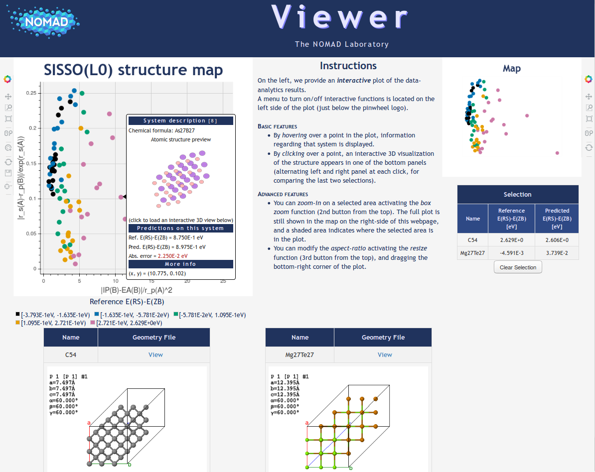

Visualization
=============================

The `ai4materials Viewer` combines `Bokeh <https://bokeh.pydata.org/en/latest/>`_
(interactive visualization of large dataset) and `jsmol <http://jmol.sourceforge.net/>`_
(3D visualization of chemical structures) to allow the interactive exploration of materials science datasets.
Users can visualize crystal structures and properties of - a possibly large number of - materials in one webpage, interactively.

Below we present an example of how to create an interactive Viewer using ai4materials.
The code below allows to generate an interactive plot of the results of Ref. [1]_, in particular Fig. 2 in the article.

.. testcode::

    from ai4materials.visualization.viewer import Viewer
    from ai4materials.utils.utils_config import set_configs
    from ai4materials.utils.utils_data_retrieval import read_ase_db
    from ai4materials.visualization.viewer import read_control_file
    from ai4materials.utils.utils_config import get_data_filename
    import pandas as pd
    import webbrowser

    # read data: crystal structures, information on the plot, name of the axis
    ase_db_file_binaries = get_data_filename('data/db_ase/binaries_lowest_energy_ghiringhelli2015.json')
    results_binaries_lasso = get_data_filename('data/viewer_files/l1_l0_dim2_for_viewer.csv')
    control_file_binaries = get_data_filename('data/viewer_files/binaries_control.json')

    configs = set_configs()

    ase_atoms_binaries = read_ase_db(db_path=ase_db_file_binaries)

    # from the table, extract the coordinates for the plot, the true and the predicted value
    df_viewer = pd.read_csv(results_binaries_lasso)
    x = df_viewer['coord_0']
    y = df_viewer['coord_1']
    target = df_viewer['y_true']
    target_pred = df_viewer['y_pred']

    # define titles in the plot
    legend_title = 'Reference E(RS)-E(ZB)'
    target_name = 'E(RS)-E(ZB)'
    plot_title = 'SISSO(L0) structure map'

    # create an instance if the ai4materials Viewer
    viewer = Viewer(configs=configs)

    # read x and y axis labels from control file
    x_axis_label, y_axis_label = read_control_file(control_file_binaries)

    # generate interactive plot
    file_html_link, file_html_name = viewer.plot_with_structures(x=x, y=y, target=target, target_pred=target_pred,
                                                                 ase_atoms_list=ase_atoms_binaries, target_unit='eV',
                                                                 target_name=target_name, legend_title=legend_title,
                                                                 is_classification=False, x_axis_label=x_axis_label,
                                                                 y_axis_label=y_axis_label, plot_title=plot_title,
                                                                 tmp_folder=configs['io']['tmp_folder'])

    # open the interactive plot in a web browser
    webbrowser.open(file_html_name)

This is a screenshot of the interactive `ai4materials Viewer` generated with the code above:

Implementation details of the `ai4materials Viewer` can be found at :py:mod:`ai4materials.visualization.viewer`.
In some systems, `Google Chrome` will not correctly to load jmol, so you will be able to load the interactive plot,
but not to explore crystal structures in 3D.
To exploit all functionalities of the `ai4materials Viewer`, we recommend to use Firefox; in particular, the Viewer
was tested on `Firefox Quantum 61.0.1`.

.. [1] L. M. Ghiringhelli, J. Vybiral, S. V. Levchenko, C. Draxl, and M. Scheffler, “Big Data of Materials
   Science: Critical Role of the Descriptor,” Physical Review Letters, vol. 114, no. 10, p. 105503 .
   [`Link to article <https://link.aps.org/doi/10.1103/PhysRevLett.114.105503>`_]

.. sectionauthor:: Angelo Ziletti <angelo.ziletti@gmail.com>

Submodules
----------

.. toctree::

   ai4materials.visualization.viewer

Module contents
---------------

.. automodule:: ai4materials.visualization
    :members:
    :undoc-members:
    :show-inheritance:
